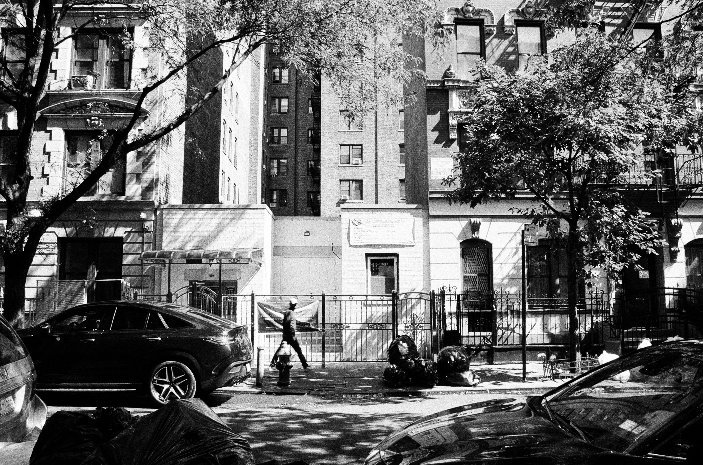
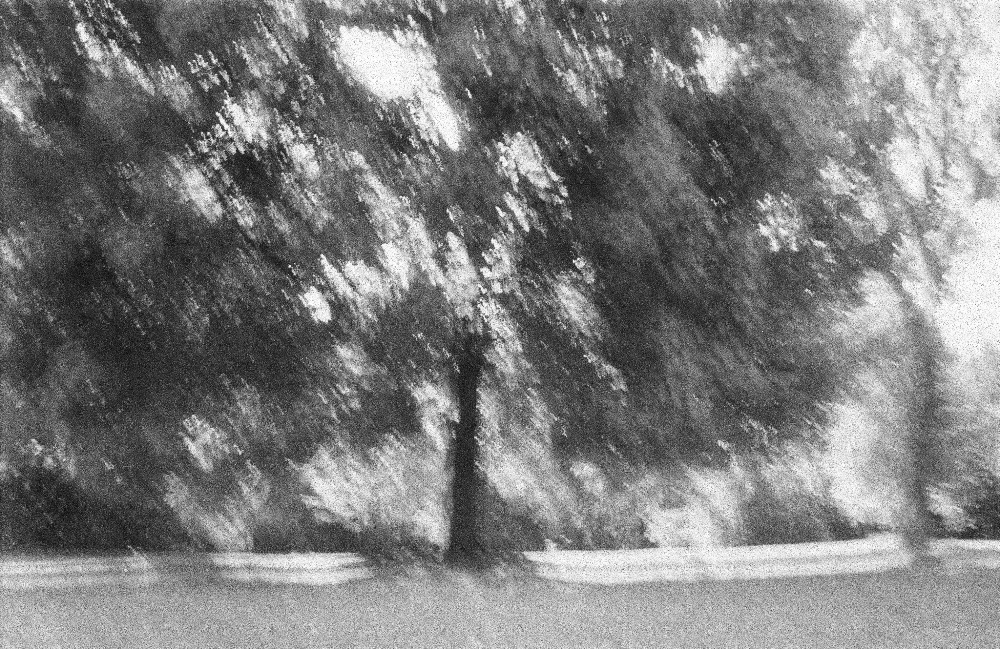

# Black and White

_A man and his trash on 108th street_

Earlier this summer I got one of those disposable kodak cameras like those cool hipsters use, and let me tell you, the rush of picking up the prints at the photo studio on w 94th street was quite the thrill! You fill this little camera with a bunch of desperately snapped photographs, and the wait between capturing the moment and seeing what you caught is fun in itself.

_This one looks like a painting I think - neat!_

Plus, there is a physical effect when you take the picture; each shot has a cost, both to your ammunition store and to your wallet. Will it anything like what you pictured, or will it be a stinker? Or maybe it's a stinker, but look sort of cool anyways. You don't get the instant gratification of an iPhone or digital camera, nor its practically unlimited storage, but that makes it a bit more mysterious.

_Ooo, lens flare_

Anyways, it was a very satisfying tactile experience, so I hopped on EBay and bought an old Rikoh point-and-shoot 35 mm film camera, cleaned out the goo and gunk that was clogging up the shutter release mechanism, loaded some film, and started snapping away 🤓! I watched about 5 minutes of instructional youtube videos on taking film photographs, set it to full auto and let her rip. These are some of the highlights of that first B+W roll! Extremely amateur, it goes without saying, but these are my favorites.

_The gang in central park_
