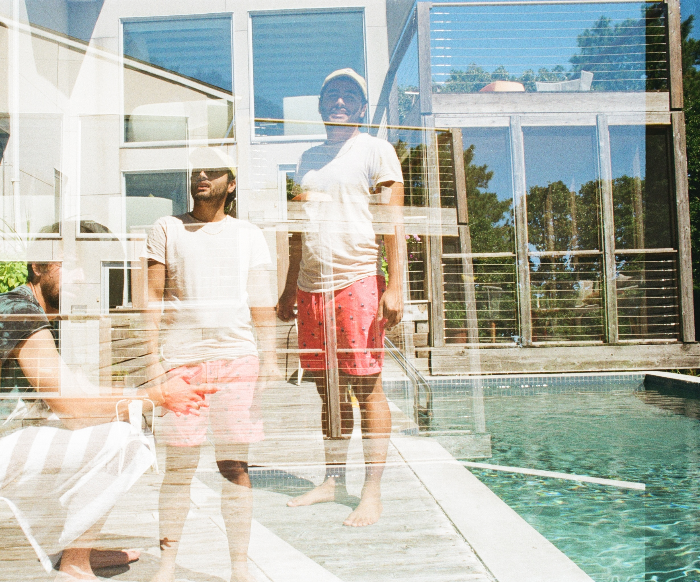

# Color, Too

## Summer ending

;
_Francisco and Alex haunting the swimming pool_

I have been having some more fun with a 35mm film camera, and wanted to put up some of my faves from my first couple color rolls.

I'm still very much stumbling through the dark, but I managed to got some interesting images (I think) and some nice memories.

_Gummy worm swimming in the pool._

_Alex and Sage_

_Alex and the sea - he caught at least a dozen dogfish that day._

<!--

_Catching the bus._ -->

## In the city

_Catching the bus._

I wanted to take a picture of all the pigeons perched on top of the mysterious subway infrastructure building, but a bus passed in front of me at the last second. I almost died for this one, but it's all worth it if I post, no? It sort of looks like a collage zoomed in like this. (That's me in the bottom left!).

_Sneakers on cathedral steps_

This one I also enlarged and cropped. It's overexposed(?) and not a stellar image, but it brings to mind walks with Francisco and taking a break to talk on the steps of St. John the Divine's. I also like the blue lines on the sneaker and the neon red/white car zipping by. Also, Francisco feet pic! lmao

_Trying to nap in Bryant Park_

This one has a fairy-tale vibe to me: he seems so separate from the aggressively urban city hovering above, sealed off by the glass stalls, and protected by a fairy light shining down from the tops of the trees.

_Trying to focus in Bryant Park_
